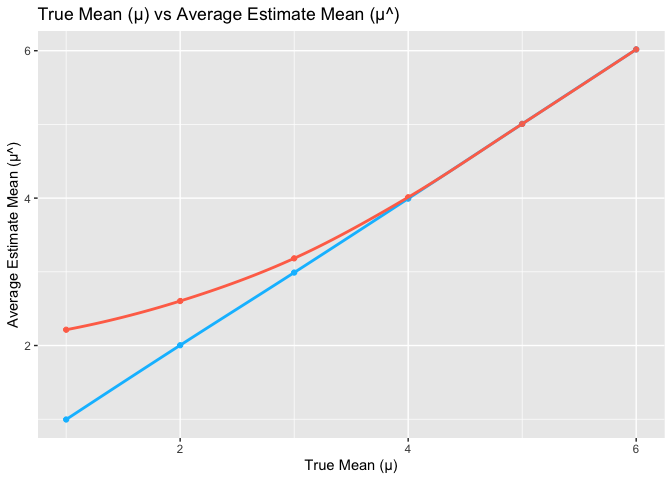

p8105_hw5_bk2959
================
Stella Koo
2024-11-04

## Problem 2

### Simulation: One-Sample T-test

``` r
library(tidyverse)
set.seed(1)

simulation = function(n = 30, mu, sigma = 5) {
  
  data = rnorm(n, mu, sigma)
  
  t_test = t.test(data) |>
    broom::tidy()
  
  sim_data = tibble(
    mu_hat = t_test$estimate,
    p_value = t_test$p.value)

}

sim_result_df = function(n = 30, mu, sigma = 5) {
  
  results = map(1:5000, ~simulation(n = n, mu = mu, sigma = sigma)) |>
    bind_rows()
  
  return(results)
  
}
```

### Mean = 0

``` r
sim_result_df(mu = 0)
```

    ## # A tibble: 5,000 × 2
    ##    mu_hat p_value
    ##     <dbl>   <dbl>
    ##  1  0.412  0.629 
    ##  2  0.664  0.368 
    ##  3  0.551  0.534 
    ##  4  0.567  0.487 
    ##  5 -1.65   0.0599
    ##  6  1.19   0.229 
    ##  7  0.334  0.738 
    ##  8 -1.19   0.209 
    ##  9  0.122  0.887 
    ## 10  0.684  0.472 
    ## # ℹ 4,990 more rows

### Mean = {1, 2, 3, 4, 5, 6}

``` r
mu_values = 1:6
mu_simulations = tibble(
  mu = mu_values,
  results = map(mu_values, ~sim_result_df(n = 30, mu = .x, sigma = 5)) 
) |>
  unnest(cols = c(results))
```

### Effect Size & Power

``` r
power_results_plot = mu_simulations |> 
  group_by(mu) |>
  summarise(power = sum(p_value < 0.05) / 5000) |>
  ggplot(aes(x = mu, y = power)) +
  geom_smooth(se = FALSE) +
  labs(title = "True Mean vs Power", x = "True Mean (µ)", y = "Power")

power_results_plot
```

    ## `geom_smooth()` using method = 'loess' and formula = 'y ~ x'

<!-- -->

As the mean of a distribution increases, the power of a statistical test
also increases, reaching a maximum of 1, where it levels off. Similarly,
as the effect size increases, power increases until it reaches a
plateau.

### Estimated Mean vs. True Mean: Overall and Null-Rejected Samples

``` r
estimate_mu = mu_simulations |>
  group_by(mu) |>
  summarise(avg_mu_hat = mean(mu_hat))

rejected_mu = mu_simulations |>
  group_by(mu) |>
  filter(p_value < 0.05) |>
  summarise(avg_mu_hat = mean(mu_hat))
  
mu_results_plot = ggplot() +
  geom_point(data = estimate_mu, aes(x = mu, y = avg_mu_hat), color = "deepskyblue") +
  geom_point(data = rejected_mu, aes(x = mu, y = avg_mu_hat), color = "coral1") +
  geom_smooth(data = estimate_mu, aes(x = mu, y = avg_mu_hat), se = FALSE, color = "deepskyblue") +
  geom_smooth(data = rejected_mu, aes(x = mu, y = avg_mu_hat), se = FALSE, color = "coral1") +
  labs(title = "True Mean (µ) vs Average Estimate Mean (µ^)", x = "True Mean (µ)", y = "Average Estimate Mean (µ^)")

mu_results_plot
```

    ## `geom_smooth()` using method = 'loess' and formula = 'y ~ x'
    ## `geom_smooth()` using method = 'loess' and formula = 'y ~ x'

<!-- -->

When the true mean exceeds 4, the sample average of µ^ across tests that
reject the null hypothesis closely approximates the actual true value of
µ. In contrast, for true means less than 4, this sample average of µ^
does not match the true value of µ. This observed pattern arises
because, when the true mean is greater than 4, both the statistical
power and effect size are substantially high, nearing 1.
